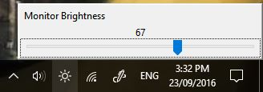

# DesktopMonitorBrightness
A utility to allow laptop like monitor brightness control on a desktop.



Features:
  - Lightwight: zero average cpu usage, less than 400k memory usage
  - Manual Brightness control from slider opened by clicking on system tray.
  - Automatic brightness based on configured sunrise and sunset times.


## Building
Requires VS2015 or above to build due to requirements for certain c++11 features.

Requires conan installed, also need to add the bincrafters remote
```
conan remote add bincrafters https://api.bintray.com/conan/bincrafters/public-conan
```

Also requires wxWidgets libraries.

## Design
Uses wxWidgets for the interface, and json for config loading / saving.
Currently only has a windows backend for setting monitor brightness, but a linux one is planned.
